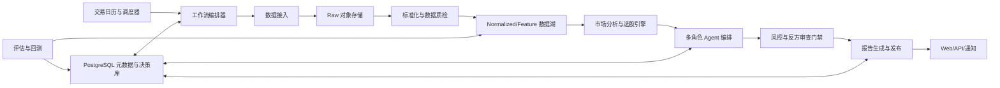
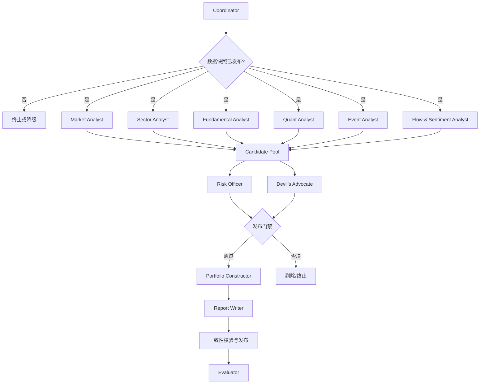
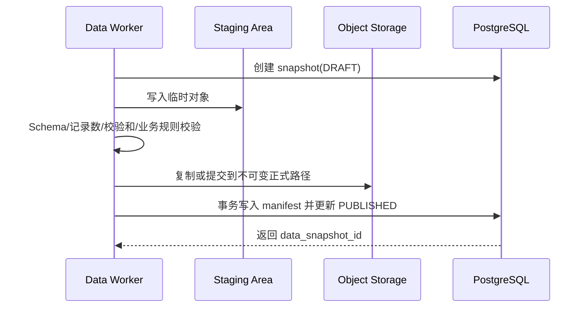
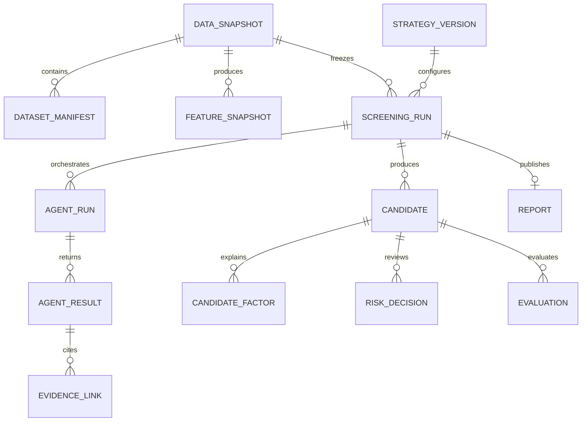

# 股票复盘与选股 Agent 技术设计文档

> 文档状态：V1.0（概要设计与详细设计基线）  
> 对应需求：[股票复盘与选股 Agent 需求文档](./stock-agent-requirements.md)  
> 首期范围：中国 A 股、收盘后运行、研究与决策支持、不自动交易

## 1. 设计目标

本设计用于指导 MVP 和 V1 的开发、测试与部署，重点保证：

- 每个交易日的数据、特征、Agent 结论、选股和报告完整落盘。
- 任意历史结果可按原数据快照、策略和角色版本重放。
- 量化计算确定、可复算，大模型只承担归纳、解释和非确定性分析。
- 多角色 Agent 可并行、可降级、可审计，风控拥有不可绕过的发布门禁。
- 初期可快速交付，同时保留扩展多市场、多策略和更多数据源的能力。

## 2. 设计原则与边界

### 2.1 核心原则

- **时间点正确**：所有数据按“当时是否已经公开可得”进行时间旅行查询。
- **不可变快照**：已发布快照和历史决策只追加，不原地覆盖。
- **确定性优先**：指标、过滤、评分和回测由代码完成，不交给大模型计算。
- **证据优先**：Agent 只能引用证据库中带来源和时间戳的内容。
- **风控优先**：硬风险规则失败后，协调 Agent 和其他角色均不能恢复候选资格。
- **幂等执行**：采集、计算、Agent、报告和通知均支持安全重试。
- **渐进式架构**：MVP 使用模块化单体和异步 Worker；容量或团队边界明确后再拆分服务。

### 2.2 不在本设计范围

- 券商交易接口、自动下单、撤单和实盘仓位管理。
- 高频或盘中实时行情处理。
- 面向公众提供投资顾问服务所需的完整牌照及合规方案。
- 自研大模型训练平台；系统通过统一模型网关调用外部或私有模型。

## 3. 技术选型建议

| 领域 | MVP 推荐 | 选择理由 | 可替换方案 |
| --- | --- | --- | --- |
| 服务端 | Python + FastAPI | 量化、数据处理和 Agent 生态统一 | Java/Spring Boot、Go |
| 元数据与业务库 | PostgreSQL | 事务、JSON、索引和时间点查询能力完善 | MySQL |
| 每日数据快照 | Parquet + S3 兼容对象存储 | 列式压缩、低成本、易于回测扫描 | 本地文件系统、云数据湖 |
| 本地分析 | Polars/DuckDB | 高效扫描 Parquet，适合日频批处理 | pandas、Spark |
| 缓存与队列 | Redis | 缓存、分布式锁和轻量队列 | RabbitMQ、Kafka |
| 工作流 | 可持久化 DAG 工作流引擎 | 支持重试、超时、补跑和状态恢复 | Celery + Beat、云调度服务 |
| Agent 编排 | 内部状态图抽象 | 明确门禁、分支和结构化状态 | 成熟图式 Agent 框架 |
| 前端 | React/Vue 管理台 | 报告、历史查询、配置和运行拓扑 | 服务端模板（MVP） |
| 可观测性 | OpenTelemetry + Metrics/Logs/Traces | 统一任务、Agent、模型和接口追踪 | 云厂商监控套件 |

所有第三方组件版本在实施时统一锁定，设计文档不绑定尚未验证的具体版本号。

## 4. 总体架构



### 4.1 部署单元

MVP 建议包含以下进程，代码仍保存在同一仓库：

- `api`：查询报告、候选、运行状态及管理配置。
- `scheduler`：根据交易日历创建每日运行实例。
- `worker-data`：采集、标准化、质检和特征计算。
- `worker-agent`：执行多角色 Agent、模型调用和 Schema 校验。
- `worker-report`：生成报告、发布和通知。
- `worker-evaluation`：更新历史候选表现及策略统计。
- PostgreSQL、对象存储、Redis 和监控组件。

MVP 可将多个 Worker 合并部署，但逻辑队列和模块边界保持独立。

### 4.2 模块依赖规则

```text
API / Scheduler / Workers
          ↓
Application（用例、工作流、事务）
          ↓
Domain（实体、规则、接口，不依赖基础设施）
          ↓
Infrastructure（数据库、对象存储、数据源、LLM、通知）
```

- Domain 层不得依赖具体数据库、模型供应商和行情供应商。
- Agent 不直接访问数据库或互联网，只能通过受控工具读取证据和特征。
- 报告模块不得重新计算指标，以决策层已发布数据为唯一数值来源。

## 5. 核心组件设计

### 5.1 调度与交易日历

- 调度器每天在配置时间检查 `trading_calendar`。
- 非交易日创建 `SKIPPED_NON_TRADING_DAY` 事件，不创建选股运行。
- 交易日以 `(market, trade_date, strategy_version_id)` 作为业务幂等范围。
- 手工补跑必须显式选择数据截止时间，可选择复用快照或创建补数快照。
- 调度器仅创建运行，不执行耗时业务，避免进程重启丢失状态。

### 5.2 数据连接器

每类数据源实现统一接口：

```python
class DataConnector(Protocol):
    source_id: str
    dataset_type: str

    def fetch(self, request: FetchRequest) -> FetchResult: ...
    def readiness(self, trade_date: date) -> ReadinessResult: ...
    def checkpoint(self) -> str | None: ...
```

`FetchResult` 包含来源请求标识、数据时间范围、抓取时间、Schema 版本、记录数、内容位置和异常。连接器负责限流、分页和网络重试，不负责业务清洗。

### 5.3 数据标准化与质检

标准化过程包括：

- 统一证券代码为 `{exchange}.{symbol}`，例如 `XSHG.600000`。
- 时间统一以 UTC 入库并携带原时区；交易日使用市场本地日期。
- 原始价格与复权因子分开存储，特征计算显式指定前复权、后复权或不复权。
- 财务和事件数据同时保存 `effective_at` 与 `known_at`；回测按 `known_at <= as_of_time` 查询。
- 行业归属按分类版本和有效期维护，禁止使用当前行业覆盖历史分类。

质检规则分三级：

- `BLOCKER`：核心行情缺失、交易日错误、主键重复、价格关系非法；阻止发布快照。
- `DEGRADED`：非核心事件源缺失、少量基本面缺失；允许降级并写入报告。
- `WARNING`：跨源轻微差异、异常值待人工检查；允许继续但生成告警。

### 5.4 特征计算引擎

- 特征通过注册表管理：名称、版本、输入数据集、窗口、空值策略和计算函数。
- 同一 `data_snapshot_id + feature_set_version` 只发布一次，重试复用已校验结果。
- 横截面标准化使用当日可交易股票池，默认先按行业 Winsorize，再计算 z-score 或分位数。
- 特征结果写入 Parquet，PostgreSQL 保存分区位置、统计摘要和校验和。
- 特征依赖形成 DAG，公共中间结果只计算一次。

特征接口示例：

```python
class FeatureDefinition(Protocol):
    name: str
    version: str
    dependencies: list[str]
    lookback_days: int

    def compute(self, frame: DataFrame, context: FeatureContext) -> DataFrame: ...
```

### 5.5 规则化选股引擎

选股分为五步：

1. 构建选股宇宙。
2. 执行硬过滤。
3. 计算和标准化因子。
4. 根据市场状态选择权重并计算综合分。
5. 执行行业分散和候选数量控制。

综合分参考公式：

```text
factor_score(i) = Σ weight(k, market_regime) × normalized_factor(i, k)
risk_adjusted_score(i) = factor_score(i) - Σ penalty(i, r)
final_score(i) = percentile_rank(risk_adjusted_score(i)) × 100
```

约束：

- 权重和阈值来自不可变 `strategy_version`，运行期间不得改变。
- 硬过滤返回规则编号和输入值，不只返回布尔值。
- 空值处理按因子预先配置为排除、中性或扣分，禁止临时补值。
- 相同快照、代码版本和策略版本必须产生完全相同的评分。
- 候选不足时允许空池或少于目标数量，不降低硬规则。

### 5.6 风控规则引擎

规则分为：

- 证券风险：ST、退市、停牌、上市天数、涨跌停可交易性。
- 流动性风险：成交额、换手、冲击成本和连续无量。
- 财务风险：经营异常、现金流恶化、审计意见和高负债。
- 事件风险：监管处罚、重大诉讼、大额解禁和未决重大事项。
- 组合风险：行业集中、相关性、单一主题暴露和波动聚集。

规则输出：

```json
{
  "rule_id": "RISK-TRADE-001",
  "rule_version": "1.0",
  "security_id": "XSHG.600000",
  "severity": "HARD_VETO",
  "passed": false,
  "observed_value": "SUSPENDED",
  "threshold": "NORMAL_TRADING",
  "evidence_refs": ["evidence-id"],
  "evaluated_at": "2026-08-11T08:45:00Z"
}
```

只有所有 `HARD_VETO` 通过且发布门禁通过的股票才能进入重点候选池。

## 6. 多角色 Agent 设计

### 6.1 编排图



### 6.2 运行上下文

`AgentContext` 只传递以下内容：

- 运行、数据快照、策略和角色版本 ID。
- 角色允许读取的特征视图和证据引用。
- 上游角色的结构化结论；默认不传递其原始思考过程。
- Token、工具次数、耗时和重试预算。
- 输出 JSON Schema 和安全策略。

角色不得接收数据库凭证、对象存储密钥和其他角色的系统 Prompt。

### 6.3 统一输出协议

```json
{
  "schema_version": "agent-result/1.0",
  "run_id": "uuid",
  "agent_run_id": "uuid",
  "role_id": "market_analyst",
  "role_version": "1.2.0",
  "strategy_version": "strategy-id",
  "data_snapshot_id": "snapshot-id",
  "as_of_time": "2026-08-11T08:30:00Z",
  "status": "SUCCEEDED",
  "confidence": 0.78,
  "conclusions": [],
  "evidence": [],
  "risks": [],
  "assumptions": [],
  "missing_data": [],
  "disagreements": [],
  "model": {
    "provider": "configured-provider",
    "model_id": "configured-model",
    "prompt_version": "prompt-id"
  },
  "usage": {
    "input_tokens": 0,
    "output_tokens": 0,
    "latency_ms": 0,
    "tool_calls": 0
  }
}
```

输出首先进行 JSON 解析和 Schema 校验，再进行证券代码、证据引用、时间点和数值范围等语义校验。失败时最多按角色配置重试；仍失败则进入降级或终止分支。

### 6.4 工具设计

Agent 可用工具采用允许清单：

- `get_market_features(snapshot_id, fields)`
- `get_security_features(snapshot_id, security_ids, fields)`
- `search_evidence(snapshot_id, query, filters)`
- `get_strategy_rules(strategy_version_id)`
- `get_upstream_results(run_id, role_ids)`
- `submit_structured_result(agent_run_id, payload)`

工具层自动注入 `run_id`、权限范围和审计信息。查询必须绑定快照，禁止 Agent 使用“最新数据”别名。

### 6.5 证据与引用

证据对象包含：

- `evidence_id`、类型和摘要。
- 来源 ID、原始 URL 或数据集位置。
- `published_at`、`known_at`、抓取时间和数据截止时间。
- 内容哈希、可信度等级、涉及证券和主题。
- 原文片段位置或指标字段路径。

报告只渲染通过校验的引用。外部正文在进入模型前添加“不可信数据”边界并清理可执行标记，工具执行权永远不来自正文。

### 6.6 冲突与仲裁

冲突键使用 `(security_id, topic, horizon)`。仲裁分值用于排序分歧，不替代硬风控：

```text
support = confidence
        × source_reliability
        × freshness
        × role_domain_weight
        × historical_calibration
```

- 支持与反对差距超过阈值时采用高分观点，并保留反方摘要。
- 差距未超过阈值时标记 `UNRESOLVED`，降级至观察池或剔除。
- `HARD_VETO` 不参与加权，直接否决。
- 人工覆盖必须具有审批权限、原因、证据、有效期和审计记录。

### 6.7 降级策略

| 故障 | 处理 |
| --- | --- |
| 单个非关键 Agent 超时 | 重试后标记降级，继续执行并披露缺失 |
| Quant 或 Risk Agent 失败 | 终止选股发布 |
| LLM 全部不可用 | 保留确定性量化结果，生成模板化降级报告 |
| 事件源不可用 | 事件角色降级，候选增加数据缺失提示 |
| 输出引用不存在 | 拒绝该结论，重试或降级 |
| 成本或循环超限 | 熔断该角色，不自动增加预算 |

## 7. 每日数据落盘设计

### 7.1 分层目录

```text
stock-agent-data/
  raw/market=XSHG_XSHE/trade_date=YYYY-MM-DD/dataset=quotes/source=xxx/ingestion_id=.../
  normalized/market=XSHG_XSHE/trade_date=YYYY-MM-DD/dataset=quotes/schema=v1/
  feature/market=XSHG_XSHE/trade_date=YYYY-MM-DD/feature_set=v1/snapshot_id=.../
  decision/trade_date=YYYY-MM-DD/run_id=.../role=.../
  report/trade_date=YYYY-MM-DD/run_id=.../
  manifests/snapshot_id=.../manifest.json
```

路径只用于分区和运维，不作为唯一业务主键；所有引用使用数据库中的 ID 和对象 URI。

### 7.2 快照发布协议



- 查询端只读取 `PUBLISHED` 或明确允许的 `DEGRADED` 快照。
- 对象写入成功、数据库事务失败时，由清理任务标记孤儿对象，不暴露给业务查询。
- 数据库提交成功前必须确认所有必需对象存在且校验和匹配。
- `is_current` 通过单独事务切换，同一市场和交易日最多一个当前发布快照。

### 7.3 Manifest 示例

```json
{
  "snapshot_id": "uuid",
  "market": "CN_A",
  "trade_date": "2026-08-11",
  "as_of_time": "2026-08-11T08:30:00Z",
  "status": "PUBLISHED",
  "schema_version": "snapshot-manifest/1.0",
  "datasets": [
    {
      "type": "daily_quote",
      "source": "provider-a",
      "uri": "s3://bucket/normalized/.../part-000.parquet",
      "rows": 5000,
      "sha256": "...",
      "quality_status": "PASSED"
    }
  ],
  "code_version": "git-commit",
  "created_at": "2026-08-11T08:35:00Z"
}
```

### 7.4 保留和恢复

- Raw、已发布快照、策略输入、决策、报告和审计默认长期保留。
- Staging 对象超过设定时间且未被 manifest 引用时进入隔离清理清单。
- 每日数据库增量备份，对象存储开启版本化或不可变保留能力。
- 每季度至少执行一次从备份恢复指定交易日并重放报告的演练。
- 删除用户持仓或偏好时采用业务删除流程；公共行情快照与用户数据分区隔离。

## 8. 数据模型

### 8.1 关系概览



### 8.2 核心表

#### `data_snapshot`

| 字段 | 类型 | 说明 |
| --- | --- | --- |
| `id` | UUID PK | 快照 ID |
| `market` | VARCHAR | 市场 |
| `trade_date` | DATE | 交易日 |
| `as_of_time` | TIMESTAMPTZ | 数据截止时间 |
| `status` | VARCHAR | DRAFT/VALIDATING/PUBLISHED/DEGRADED/FAILED |
| `schema_version` | VARCHAR | Manifest 版本 |
| `is_current` | BOOLEAN | 当前有效版本 |
| `code_version` | VARCHAR | 构建或提交版本 |
| `created_at/published_at` | TIMESTAMPTZ | 创建/发布时间 |

约束：同一 `(market, trade_date)` 仅一个 `is_current = true`；已发布记录禁止更新业务字段。

#### `dataset_manifest`

包含 `snapshot_id`、数据类型、来源、对象 URI、Schema 版本、记录数、最小/最大业务时间、校验和、质量状态和质量报告 JSON。

#### `strategy_version`

包含策略 ID、语义版本、状态、股票池规则、因子权重、市场状态映射、过滤规则、分散约束、基准、成本参数、创建人与审批信息。发布后不可变。

#### `screening_run`

包含 `run_id`、市场、交易日、快照、策略版本、状态、触发类型、幂等键、降级原因、开始/结束时间和发布报告 ID。

#### `agent_run` 与 `agent_result`

- `agent_run`：角色版本、依赖、状态、重试次数、预算、模型和时间信息。
- `agent_result`：结构化结果 JSON、Schema 版本、置信度、输出哈希和校验状态。
- 每次重试建立新的 attempt，保留失败输出但不进入后续聚合。

#### `candidate`、`candidate_factor` 与 `risk_decision`

- `candidate`：证券、候选层级、最终分、排名、状态、入池/剔除原因。
- `candidate_factor`：原始值、标准化值、权重、贡献分、特征版本。
- `risk_decision`：规则、严重度、是否通过、观测值、阈值、证据和人工覆盖信息。

#### `evidence` 与 `evidence_link`

- `evidence` 保存来源、发布时间、当时可见时间、内容哈希、可信等级及对象位置。
- `evidence_link` 将证据关联至 Agent 结论、候选原因、风险决定或报告段落。

### 8.3 索引与分区

- 大型日频关系表按 `trade_date` 月度范围分区。
- 常用索引：`(market, trade_date)`、`(security_id, trade_date DESC)`、`(run_id, status)`、`(snapshot_id, dataset_type)`。
- JSON 字段仅保存扩展内容；高频过滤字段必须独立成列。
- 对象存储 Parquet 文件目标大小保持适中，避免大量小文件；每日发布后执行合并。

## 9. 工作流与状态机

### 9.1 主运行状态

```text
CREATED
  → WAITING_FOR_DATA
  → INGESTING
  → VALIDATING_DATA
  → SNAPSHOT_PUBLISHED
  → COMPUTING_FEATURES
  → RUNNING_ANALYSIS
  → SCREENING
  → RISK_REVIEW
  → GENERATING_REPORT
  → PUBLISHING
  → SUCCEEDED | DEGRADED_SUCCEEDED

任一阶段 → FAILED
非交易日 → SKIPPED
```

状态迁移使用数据库乐观锁或条件更新，防止两个 Worker 同时推进同一实例。

### 9.2 幂等键

| 阶段 | 幂等键 |
| --- | --- |
| 日常运行 | `market + trade_date + strategy_version + trigger_type` |
| 数据采集 | `source + dataset + trade_date + source_revision` |
| 快照 | `market + trade_date + ingestion_set_hash` |
| 特征 | `snapshot_id + feature_set_version` |
| Agent | `run_id + role_version + attempt` |
| 报告 | `run_id + report_template_version + language` |
| 通知 | `report_id + channel + recipient_hash` |

### 9.3 重试与超时

- 网络类、限流类和暂时性错误使用指数退避并加入随机抖动。
- Schema 错误最多进行一次带错误说明的修复重试，避免无限循环。
- 业务硬失败不重试，例如交易日不匹配、风险门禁失败。
- 每阶段设置绝对截止时间；超过日报发布时间后转为降级或失败。

## 10. API 设计

API 前缀建议为 `/api/v1`，时间字段使用 ISO 8601，分页采用游标模式。

### 10.1 查询接口

| 方法 | 路径 | 说明 |
| --- | --- | --- |
| GET | `/reports?trade_date=&market=` | 报告列表 |
| GET | `/reports/{report_id}` | 报告详情及数据状态 |
| GET | `/runs/{run_id}` | 运行状态、阶段和降级原因 |
| GET | `/runs/{run_id}/topology` | Agent 执行拓扑 |
| GET | `/candidates?run_id=&tier=` | 候选池 |
| GET | `/candidates/{candidate_id}` | 单股卡片及决策链 |
| GET | `/snapshots?trade_date=&market=` | 快照版本列表 |
| GET | `/snapshots/{snapshot_id}/manifest` | 数据清单和质检结果 |
| GET | `/strategies/{id}/versions` | 策略历史版本 |
| GET | `/evaluations?strategy_id=&period=` | 策略效果 |

### 10.2 管理接口

| 方法 | 路径 | 说明 |
| --- | --- | --- |
| POST | `/runs` | 人工创建补跑或重放任务 |
| POST | `/strategies/{id}/versions` | 创建草稿版本 |
| POST | `/strategy-versions/{id}/publish` | 审批并发布策略 |
| POST | `/roles/{id}/versions` | 创建角色配置版本 |
| POST | `/risk-decisions/{id}/overrides` | 人工覆盖申请/审批 |
| POST | `/feedback` | 提交候选反馈 |

所有写接口要求身份认证、权限校验、幂等请求头和审计记录。人工补跑默认不改变当日当前报告，需另行执行发布操作。

### 10.3 错误格式

```json
{
  "error": {
    "code": "SNAPSHOT_NOT_PUBLISHED",
    "message": "指定数据快照尚未发布",
    "request_id": "uuid",
    "details": {}
  }
}
```

## 11. 报告生成与发布

### 11.1 报告数据模型

先生成与展示无关的 `ReportViewModel`，再渲染 Markdown/HTML/PDF：

- 执行摘要与市场状态。
- 数据质量和降级说明。
- 指数、广度、成交和风格数据。
- 行业、主题与事件。
- 重点候选、观察候选和被风控剔除摘要。
- 多角色分歧、风险提示和免责声明。
- 数据快照、策略、角色、模型和模板版本。

### 11.2 发布门禁

发布必须满足：

- 数据快照处于允许状态，核心数据集全部通过。
- Quant 和 Risk 角色成功。
- 所有展示数值能映射到特征或决策字段。
- 所有关键自然语言结论至少关联一项有效证据。
- 候选不存在未处理的硬否决。
- 报告模板验证、链接检查和免责声明检查通过。

发布采用新建版本并切换当前指针，不覆盖旧报告。通知必须在报告发布事务完成后异步发送。

## 12. 回测与评估设计

### 12.1 防止未来函数

- 回测只读取 `known_at <= decision_as_of_time` 的数据。
- 使用历史行业成分、证券状态、涨跌停规则和当时策略版本。
- 财务数据以实际披露时间进入可用集合，不按报告期末日期提前使用。
- 退市股票保留在历史股票池中，避免幸存者偏差。

### 12.2 交易模拟

- 默认次日开盘或用户配置价格作为模拟成交基准。
- 计入佣金、印花税、滑点、最小交易单位、停牌和涨跌停无法成交。
- 无法成交的信号单独统计，不用后续可成交价替换原成交假设。
- 输出绝对收益、相对基准/行业收益、最大回撤、胜率、盈亏比和换手。

### 12.3 Agent 评估

- 结构合格率：输出是否通过 Schema 与语义验证。
- 引用覆盖率：关键结论中有有效证据的比例。
- 置信度校准：按置信度分桶比较实际正确率。
- 增量贡献：移除某角色或因子后的候选表现变化。
- 风控价值：被拦截标的后续风险事件和极端损失比例。
- 独立性：角色观点相关性异常升高时告警。

评估结果只形成建议，不能自动修改生产策略和 Prompt。

## 13. 安全与权限设计

### 13.1 角色权限

- `viewer`：查看报告和公开候选数据。
- `researcher`：创建回测和策略草稿。
- `strategy_approver`：发布策略版本。
- `risk_approver`：审批风险人工覆盖。
- `operator`：补跑、重试和处理数据异常。
- `admin`：用户、角色和系统配置管理。

策略发布与风险覆盖建议启用双人审批，审批人与创建人不能相同。

### 13.2 密钥与敏感数据

- 数据源、模型和通知凭证从密钥管理服务注入，禁止进入数据库正文和日志。
- 持仓数据按用户或租户隔离并加密；公共行情和用户数据使用不同存储前缀及访问策略。
- 日志仅保存接收人哈希、工具参数摘要和脱敏错误信息。

### 13.3 Agent 安全

- 模型输出不直接拼接 SQL、对象路径、Shell 命令或通知内容。
- 外部内容与系统指令使用明确通道隔离。
- 工具参数经过类型、范围、证券数量和快照权限校验。
- 工具默认只读；策略发布、通知和导出不作为普通分析 Agent 工具。
- 保存 Prompt 和输出哈希用于审计，敏感上下文按策略脱敏。

## 14. 可观测性设计

### 14.1 指标

- 数据：就绪延迟、覆盖率、缺失率、异常值数、快照发布时间。
- 工作流：成功率、阶段耗时、重试数、积压量和降级率。
- Agent：耗时、Token、费用、Schema 失败、引用缺失和置信度分布。
- 策略：候选数、过滤率、行业集中度、分数漂移和历史表现。
- API：请求量、错误率、P50/P95/P99 延迟。

### 14.2 日志与追踪

- 所有日志包含 `request_id`、`run_id`、`snapshot_id` 和可选 `agent_run_id`。
- 从调度、数据采集、模型调用到报告发布使用同一分布式 Trace。
- 模型请求记录元数据和内容哈希；是否保存完整内容由隐私策略控制。

### 14.3 告警

- 核心数据未在截止时间就绪。
- 快照发布失败或覆盖率低于阈值。
- Quant/Risk Agent 失败。
- 报告未按时发布、通知连续失败。
- 模型成本、Token 或调用次数超过预算。
- 候选数量、行业集中或因子分布出现显著漂移。

## 15. 测试设计

### 15.1 测试层次

- 单元测试：指标、复权、标准化、风险规则、评分和状态迁移。
- 契约测试：数据连接器、Agent 输出 Schema、模型网关和通知适配器。
- 集成测试：PostgreSQL、对象存储、队列和完整快照发布协议。
- 黄金数据回归：固定交易日、快照和策略的特征及候选结果逐字段比较。
- 端到端测试：从调度到报告发布，再到次日效果更新。
- 故障注入：网络中断、重复消息、Worker 重启、对象写入成功但数据库失败。
- 安全测试：提示注入、越权工具、恶意链接、敏感日志和权限绕过。
- 回测正确性测试：未来函数、退市股票、停牌和涨跌停场景。

### 15.2 关键验收场景

1. 同一快照和策略重复运行，确定性评分逐位一致。
2. 补数生成新快照，旧报告仍读取旧数据。
3. 模拟半写入对象，查询端不读取未发布快照。
4. Risk Agent 返回硬否决，候选无法进入重点池。
5. 新闻正文包含越权指令，工具层拒绝并产生安全审计。
6. 模型不可用时仍生成明确标记的量化降级报告。
7. 指定历史快照可重建特征并重放报告。
8. 从备份恢复数据库和对象后，引用关系与校验和完整。

## 16. 部署与容量

### 16.1 环境

- `local`：本地数据库和对象存储模拟服务，使用脱敏样例数据。
- `test`：运行集成、黄金数据和故障注入测试。
- `staging`：使用近生产数据规模验证定时任务和模型预算。
- `production`：生产密钥、备份、告警和审批流程全部开启。

各环境的对象桶、数据库、队列和密钥完全隔离。

### 16.2 初期容量假设

- 股票数量：约数千只量级。
- 核心频率：每个交易日一次日线全量处理，允许当日补跑。
- 报告：每市场、策略和交易日生成版本化报告。
- 单次分析在数据就绪后 15 分钟内完成。

在详细实施前使用真实数据样本进行基准测试，再确定 Worker 并发、数据库规格、Parquet 分片大小和模型调用并发。

### 16.3 扩展路径

- 数据量上升：从单机 Polars/DuckDB 迁移到分布式计算，保持 Parquet 和特征契约不变。
- 任务量上升：按数据、Agent、报告和评估队列独立扩容 Worker。
- 多租户：在业务表增加 `tenant_id`，配合数据库行级策略和对象前缀隔离。
- 多市场：新增市场日历、证券编码、交易规则和本地时区适配器。

## 17. 建议代码结构

```text
StockAgent/
  apps/
    api/
    scheduler/
    worker/
  src/stock_agent/
    domain/
      data/
      features/
      strategy/
      risk/
      agents/
      reports/
      evaluation/
    application/
      workflows/
      commands/
      queries/
    infrastructure/
      database/
      object_store/
      connectors/
      llm/
      queue/
      notifications/
    interfaces/
      api/
      cli/
  schemas/
    agent/
    data/
    report/
  migrations/
  configs/
    strategies/
    roles/
    quality_rules/
  templates/
    reports/
  tests/
    unit/
    contract/
    integration/
    golden/
    e2e/
  docs/
```

## 18. 实施顺序

### 阶段一：数据与确定性内核

- 建立项目骨架、数据库迁移、对象存储和统一 ID/时间规范。
- 实现交易日历、基础行情连接器、Raw/Normalized 落盘及 manifest。
- 实现数据质检、特征注册表、基础因子、选股和硬风控规则。
- 建立固定交易日黄金数据测试。

### 阶段二：运行与报告

- 实现每日工作流、状态机、幂等、重试和告警。
- 实现报告 ViewModel、Markdown/HTML 模板、历史查询 API 和通知。
- 实现候选表现回收与基础策略指标。

### 阶段三：多角色 Agent

- 先实现 Coordinator、Market、Quant、Risk 和 Report 五个 MVP 角色。
- 建立模型网关、工具允许清单、输出 Schema、证据引用和成本熔断。
- 完成提示注入、角色越权、模型失败和降级测试。

### 阶段四：V1 能力

- 接入基本面、估值、公告与可靠新闻。
- 增加行业、事件、反方、组合、评估等角色。
- 建设策略/角色配置管理、审批、回测和运行拓扑页面。

## 19. 关键设计决策记录

| 决策 | 当前选择 | 原因 |
| --- | --- | --- |
| 初期服务形态 | 模块化单体 + Worker | 降低分布式复杂度，保留清晰边界 |
| 大数据存储 | Parquet + 对象存储 | 适合日频列式分析和长期低成本保存 |
| 业务元数据 | PostgreSQL | 事务保证快照发布、决策链和审批一致性 |
| Agent 通信 | 结构化状态与 Schema | 可校验、可审计、减少上下文污染 |
| 量化与 LLM 边界 | 代码计算，LLM 解释 | 确定性、可复算并降低幻觉风险 |
| 历史更新 | 新快照，不覆盖 | 保证回测和报告可重现 |
| 风控决策 | 硬否决门禁 | 防止推荐逻辑绕过风险规则 |

## 20. 实施前待确认

- 实际数据源、授权范围、接口限流、历史数据深度和费用。
- 首期部署在本地、私有服务器还是公有云，对象存储具体实现。
- 工作流引擎、模型供应商和通知渠道的最终选型。
- 选股周期、基准指数、交易成本、硬过滤阈值和默认因子权重。
- MVP 是否需要前端，或先以 API 和静态 HTML 报告交付。
- 数据保留期限、备份介质、RPO/RTO 和人工风险覆盖审批人。
- 是否允许用户创建自定义角色；若允许，需要额外的沙箱、配额和发布审批设计。

## 21. 需求追踪矩阵

| 需求主题 | 设计章节 |
| --- | --- |
| 每日收盘复盘 | 5、9、11 |
| 次日选股与解释 | 5.4～5.6、8、11 |
| 多角色 Agent | 6 |
| 每日数据落盘 | 7、8 |
| 数据质量与时间点 | 5.3、7、12.1 |
| 策略版本与回测 | 5.5、8、12 |
| 风控与反方审查 | 5.6、6.6、11.2 |
| 报告、查询和通知 | 10、11 |
| 权限、安全和审计 | 13 |
| 性能、可靠性和监控 | 9、14、16 |
| 测试与验收 | 15 |

> 本设计中的具体技术组件是推荐方案，不改变需求边界。数据源、部署环境和默认策略参数确认后，应补充对应 ADR、数据库 DDL、OpenAPI 文件、JSON Schema 和运行手册。
